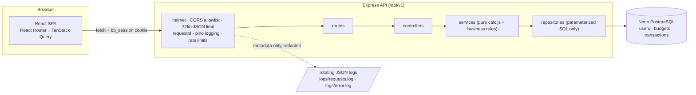

# Budgeting App

A single-user personal budgeting app: register/login, ONE private recurring
budget per user (income + seven fixed category plans, applied identically to
every month; edited in place via click-to-edit popups), per-month expense
tracking with instant recalculation, and a spending-insights dashboard
comparing 1–3 selected months. Built as a single delivery across the sprint
sections of `docs/product/Budgeting_App_Development_Roadmap.md`, then
revised by `docs/product/change-request-001.md` (CR-001).

Stack: **React** (Vite, React Router, TanStack Query) on the client,
**Node.js/Express** on the server, **PostgreSQL** (hosted on **Neon**) for
storage, JWT-in-HTTP-only-cookie sessions, and hand-rolled accessible SVG
charts (no chart library).

## Prerequisites

- Node.js 20+ and npm 10+
- Git
- A reachable PostgreSQL database (this project targets Neon; any Postgres
  13+ with `gen_random_uuid()` available works)

## Setup (macOS/Linux) — clone to running

```bash
git clone <this-repo>
cd FinancialPlanning
cp .env.example .env
# Edit .env: set DATABASE_URL to your Postgres/Neon connection string, then
# generate a session-signing secret (never printed/echoed anywhere else):
printf 'JWT_SECRET=%s\n' "$(openssl rand -hex 32)" >> .env

npm ci               # single root install; one lockfile for both workspaces
npm run migrate      # applies server/src/db/migrations/*.sql (idempotent)
npm run dev          # server (http://localhost:4000) + client (http://localhost:5173)
```

Open `http://localhost:5173` and create an account. In development the
client's Vite dev server proxies `/api` to Express, so no CORS configuration
is needed locally. There are no undocumented secrets: `DATABASE_URL` and
`JWT_SECRET` are the only required values, both created by the steps above.

### Production-style run (one server, one port)

```bash
npm run build
SERVE_CLIENT=true npm run start -w server
```

Express then serves the built client from `client/dist` with an SPA
fallback, so refreshing `/budget`, `/insights`, etc. works — all on
`http://localhost:4000`. Configuration is entirely environment-driven; no
machine-specific URLs are hard-coded anywhere.

### Demo data (optional, guarded)

```bash
ALLOW_DEMO_SEED=true npm run seed:demo
```

Creates/refreshes the deterministic demo account `demo@example.com` /
`DemoPass123!` with one recurring budget (income 12,500; seven plans
totalling 12,000) and the current and previous months populated across all
seven categories (monthly totals 8,420 / 9,180, matching the design kit's
reference cash-flow series). The seed **refuses to run** without
`ALLOW_DEMO_SEED=true` or when `NODE_ENV=production`, is idempotent, and
touches only the demo user's data. See `docs/demo-script.md` for the
rehearsed demo walk.

### Backup / reset

All state lives in the database. To reset a local environment: drop the
three tables (or the schema), then re-run `npm run migrate` and (optionally)
the demo seed. Neon's dashboard provides point-in-time restore for real
backups.

## Architecture



Server code is factory-wired (`createApp(config)` builds its own pool,
loggers, repositories, and services per instance) — no module-level
singletons, which is what lets every integration test boot a real, fully
isolated server in-process.

## Data model

Full DDL: `server/src/db/migrations/001_init.sql` +
`002_single_budget.sql` (applied in order by `npm run migrate`, tracked in
`schema_migrations`). Migration 002 implements CR-001: it replaces the
per-month `budget_periods` model with one `budgets` row per user
(latest-month-wins backfill), extends the category set to seven, re-scopes
transaction idempotency to the user, and drops `budget_periods`.

- `users(id, email UNIQUE lowercase, password_hash, timestamps)` — bcrypt
  hashes; passwords never returned or logged.
- `budgets(id, user_id FK UNIQUE, currency_code, income_minor,
categories JSONB, timestamps)` — exactly one per user, provisioned at
  registration. `categories` holds the seven fixed categories (`housing`,
  `groceries`, `transport`, `fun`, `savings`, `subscriptions`, `utilities`)
  with their planned amounts; names/icons/colors/order are server constants.
- `transactions(id, user_id FK, category_id, type, amount_minor > 0,
occurred_on DATE, note ≤200, client_request_id, timestamps)` — month
  membership is derived from `occurred_on` (date-range scoped queries); a
  partial unique index on `(user_id, client_request_id)` makes retried
  submissions idempotent.

## Money and dates

USD, no displayed symbol, `1,234` formatting; **all money is stored and
computed as integer minor units (cents)**. Client input is parsed by string
splitting (never `parseFloat` arithmetic) via `client/src/lib/money.js`;
server responses carry integer `*Minor` fields only. Dates are plain
calendar strings (`YYYY-MM`, `YYYY-MM-DD`) with no timezone math anywhere.
Progress percentages use `Math.round(actual/planned×100)`; donut shares use
the largest-remainder method so they always total exactly 100.

## API

Documented in **`docs/api.md`**: every endpoint with sanitized real
request/response examples, the single error envelope, and the status-code
contract. Highlights: sessions via HTTP-only `bb_session` cookie; strict
zod validation (unknown keys rejected); another user's resources always
answer `404` with no existence leak; every response carries `X-Request-Id`.

## Environment variables

| Var                                      | Required | Default                 | Notes                                                       |
| ---------------------------------------- | -------- | ----------------------- | ----------------------------------------------------------- |
| `DATABASE_URL`                           | yes      | —                       | Neon/Postgres connection string; never logged               |
| `JWT_SECRET`                             | yes      | —                       | HS256 session-signing secret; never logged                  |
| `PORT`                                   | no       | `4000`                  | Express listen port                                         |
| `NODE_ENV`                               | no       | `development`           | `development` \| `test` \| `production`                     |
| `LOG_DIR`                                | no       | `<repo>/logs`           | gitignored; rotating request/error logs                     |
| `CORS_ORIGIN`                            | no       | `http://localhost:5173` | comma-separated allowlist                                   |
| `DB_SCHEMA`                              | no       | `public`                | tests use isolated `test_*` schemas                         |
| `BCRYPT_ROUNDS`                          | no       | `10`                    | password hashing cost                                       |
| `RATE_LIMIT_MAX` / `RATE_LIMIT_AUTH_MAX` | no       | `300` / `10` per 15 min | general vs. strict auth limiter                             |
| `ALLOW_DEMO_SEED`                        | no       | unset                   | demo seed refuses unless `true` and not production          |
| `SERVE_CLIENT`                           | no       | unset                   | when `true`, Express serves `client/dist` with SPA fallback |

The server fails fast on missing/invalid required variables, printing only
the offending variable **names**, never values.

## Scripts

Run from the repo root (npm workspaces: `client/`, `server/`):

| Script                     | Description                                                                                                  |
| -------------------------- | ------------------------------------------------------------------------------------------------------------ |
| `npm run dev`              | Runs server + client concurrently                                                                            |
| `npm run lint`             | ESLint across both workspaces                                                                                |
| `npm run format:check`     | Prettier check                                                                                               |
| `npm test`                 | Server unit tests + client component tests                                                                   |
| `npm run test:integration` | Server real-HTTP integration tests (needs `DATABASE_URL`)                                                    |
| `npm run coverage`         | Coverage for both workspaces (≥70% thresholds enforced)                                                      |
| `npm run build`            | Production client build (Vite)                                                                               |
| `npm run migrate`          | Runs pending SQL migrations against `DATABASE_URL`                                                           |
| `npm run seed:demo`        | Deterministic demo data (guarded; see env table)                                                             |
| `npm run smoke`            | 17-check end-to-end journey against a **running** server (`SMOKE_BASE_URL`, default `http://localhost:4000`) |

## Testing and coverage

- **Unit tests** (`server/tests/unit`): pure calculation rules, validation
  schemas, auth service/middleware, log rotation proof.
- **Real-HTTP integration tests** (`server/tests/integration`): every suite
  boots a real listening server (`app.listen(0)`) and talks to it with
  `fetch` — auth journeys, budget math, expenses with idempotent retries,
  concurrency conflicts, insights coherence, the full error contract,
  security checks (headers, CORS, limits, injection corpus, ownership
  matrix), graceful shutdown, and SPA serving. Each run creates an isolated
  Postgres schema (`test_<timestamp>_<pid>_<random>`) on the configured
  database, migrates it, and drops it afterward — `public` data is never
  touched.
- **Component tests** (`client/tests`): pages, dialogs (focus management,
  double-submit protection), charts (fixture-driven), API client, session
  expiry.
- **Coverage**: `npm run coverage` — vitest + V8. Thresholds of 70%
  lines/statements/functions (60% branches) are enforced in both
  `vitest.config.js` files; the run fails if they are breached. Delivery-2
  developer-scoped numbers (QA suites excluded during the CR-001 build):
  server 97% statements / 92.26% branches / 99.08% functions; client
  85.42% / 83.56% / 82.92%.

## Logging and security

- Structured JSON request logs (`logs/requests.log`) and error logs
  (`logs/error.log`) — external files, git-ignored, rotated by `pino-roll`
  (5 MB, 5 files kept; rotation/retention proven by test). At least one log
  entry per request; errors logged with the request's id. Logs are
  metadata-only: no passwords, tokens, cookies, notes, or request/response
  bodies (enforced by redaction paths and asserted by tests).
- `helmet` security headers, strict CORS allowlist (foreign origins receive
  no CORS headers), 32 kb JSON body limit (413 beyond it), and rate
  limiting (general + stricter auth limiter).
- All SQL is parameterized; an injection corpus test proves malicious input
  is rejected or stored as inert text. Every private query filters by the
  session user at the repository layer.
- Security review evidence: `server/tests/integration/security.test.js` and
  the Stage H checklist under `.workflow/sprints/delivery/iteration-01/
developer/evidence/security-checklist.md` (including `npm audit` accepted-
  advisory rationale).

## Design source

`docs/design/figma-kit/` is the committed design source of truth (tokens,
content, component specs, responsive rules); the six files under
`docs/design/approved/` are the approved visual compositions.
`client/src/styles/tokens.css` is a byte-identical copy of the kit's
`design-tokens.css`, and screens consume tokens only via CSS variables.

## Agile process

`docs/agile/board.md` (Kanban board: user story, acceptance IDs, and
evidence per card), `docs/agile/progress-log.md` (decision/progress
narrative per stage), and three major code-review records under
`docs/agile/reviews/`. Progress over time is visible in the per-stage
commit history on `feature/budgeting-app`.

## Mandatory vs. bonus requirements (traceability)

Course requirements from `docs/product/Project_requirements_English.md`.
Every mandatory item was completed before bonus work, as the requirements
recommend.

### Mandatory

| #   | Requirement                                                                        | Status                       | Evidence                                                                                                                                                                                                           |
| --- | ---------------------------------------------------------------------------------- | ---------------------------- | ------------------------------------------------------------------------------------------------------------------------------------------------------------------------------------------------------------------ |
| 1   | Developed on Linux/macOS, project directory, `README.md` with a description        | Done                         | This repository (built on macOS); this README                                                                                                                                                                      |
| 2   | Git; `main` as main branch; feature branches; no system files uploaded             | Done                         | Branch `feature/budgeting-app` → single PR to `main`; `.gitignore` excludes `.env`, `logs/`, `dist/`, `node_modules/`, OS files                                                                                    |
| 3   | Unit tests                                                                         | Done                         | `server/tests/unit/` (calc, schemas, auth service/middleware, log rotation), `client/tests/` — run `npm test`                                                                                                      |
| 4   | Third-party libraries to avoid reinventing the wheel; `ALL_LICENSES` file          | Done                         | `package.json` ×3; `ALL_LICENSES.md` lists every direct dependency + license                                                                                                                                       |
| 5   | Package manager with dependency file; licenses in `ALL_LICENSES`                   | Done                         | npm workspaces; root/`server`/`client` `package.json`; `ALL_LICENSES.md`                                                                                                                                           |
| 6   | Agile: small tasks, user story per task, Kanban board, progress over time          | Done                         | `docs/agile/board.md` (user stories + acceptance per card), `docs/agile/progress-log.md`, per-stage commits A–I                                                                                                    |
| 7   | ≥3 major changes code-reviewed; pull requests; comments addressed                  | Done (recorded substitution) | Three in-repo major review records `docs/agile/reviews/review-{1-auth,2-expenses,3-insights}.md` with findings and resolutions; one final PR per the repository's single-PR delivery rule                          |
| 8   | Useful logs; errors logged; ≥1 log per server request; logs saved to external file | Done                         | `server/src/logging/` — rotating `logs/requests.log` + `logs/error.log` (pino/pino-roll), metadata-only with redaction; proven in `server/tests/integration/health.test.js`, `auth.test.js`                        |
| 9   | Secure code, especially around user input                                          | Done                         | zod validation on every input, parameterized queries only, helmet/CORS/rate limits/32 kb body limit, ownership filtering; `server/tests/integration/security.test.js` (injection corpus, ownership matrix, limits) |

### Bonus

| #   | Requirement                                           | Status        | Evidence                                                                                                                                                                                      |
| --- | ----------------------------------------------------- | ------------- | --------------------------------------------------------------------------------------------------------------------------------------------------------------------------------------------- |
| B1  | ≥70% code coverage, measured by a tool                | Done          | `npm run coverage` — vitest + V8 provider; thresholds (70% lines/statements/functions, 60% branches) enforced in `server/vitest.config.js` and `client/vitest.config.js`; final numbers above |
| B2  | API integration tests against a real server over HTTP | Done          | `server/tests/integration/` — every suite boots a real listening server (`app.listen(0)`) and uses `fetch`; isolated per-run DB schemas                                                       |
| B3  | `package-lock.json` committed                         | Done          | Single root `package-lock.json` for both workspaces                                                                                                                                           |
| B4  | Basic authentication (username + password)            | Done          | Email + password register/login with bcrypt hashing and JWT-in-HTTP-only-cookie sessions (`server/src/services/authService.js`)                                                               |
| B5  | Contribute to an open-source project                  | Not attempted | Explicit non-goal for this delivery (see developer plan §non-goals)                                                                                                                           |

## Known limitations (honest scope notes)

- **Expenses cannot be edited** — add and delete only (roadmap MVP; edit is
  post-MVP backlog #1).
- **Savings is a spend-like category**: money "spent" into Savings counts
  toward monthly spending totals, matching the design source's semantics.
- **Fixed category set**: the seven categories (five original plus CR-001's
  Subscriptions and Utilities) cannot be renamed, added to, or removed
  (custom categories are post-MVP). This also means a category with
  transactions can never be orphaned.
- **Illustrative kit percentages**: the design kit's example progress bars
  (63/34/26/28/56%) are internally inconsistent with its own authoritative
  totals; the demo seed follows the authoritative numbers. Recorded product
  decision — the 63% example survives as a unit-test fixture. The kit's
  five-category content itself is extended to seven by CR-001 (user decision
  outranks kit): Subscriptions (Lucide `Repeat`, coral ramp) and Utilities
  (Lucide `Plug`, green ramp).
- **Stateless logout**: logout clears the session cookie (the browser
  session ends); issued JWTs are not server-side revocable and expire after
  24 h.
- **`npm audit` accepted advisories**: two moderate react-router 6.x items
  (unreachable in this app) and dev-only tooling items — rationale in the
  Stage H security checklist.
- **Local demo hosting only**: no public deployment; the documented
  reproducible run substitutes for it (recorded decision #5).
