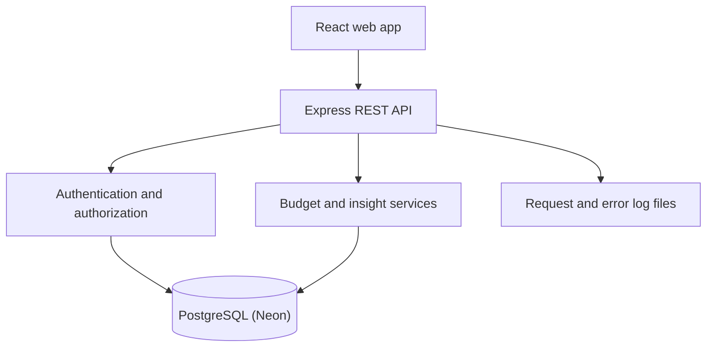

# Budgeting App — Product and Development Roadmap

**Stack:** React frontend, Node.js + Express backend, PostgreSQL database (hosted on Neon)  
**Delivery model:** Eight one-week sprints plus a three-day Sprint 0  
**Target:** A demonstrable, responsive budgeting MVP that satisfies all mandatory course requirements and the most valuable bonus requirements  
**Prepared from:** Project requirements, approved mobile and desktop layouts, and the Budgeting App Figma Source Kit

---

## 1. Executive summary

The recommended plan delivers the app in thin, testable vertical slices. Each functional sprint ends with something that can be demonstrated through the real user interface and real API—not a disconnected frontend mockup or an unintegrated backend.

The delivery sequence is:

1. Establish the repository, product rules, design system, test harness, logging, and Agile evidence.
2. Deliver secure account creation and login.
3. Display a real monthly budget from PostgreSQL.
4. Add expenses and immediately recalculate budget progress.
5. Let the user create and edit a monthly plan.
6. Generate real spending insights and month comparisons.
7. complete responsive behavior, accessibility, and resilient UI states.
8. Harden security, logging, testing, and coverage.
9. Prepare a reproducible release, final documentation, and presentation evidence.

The roadmap treats authentication as part of the MVP. Although authentication is a course bonus, the approved design contains Login and Create Account actions, and user-specific financial data cannot be handled responsibly without account separation.

### Planned milestones

| Milestone | End of | Demonstrable outcome |
|---|---:|---|
| M0 — Ready to build | Sprint 0 | Repository, backlog, design foundations, API conventions, test/logging baseline |
| M1 — Walking skeleton | Sprint 1 | User can register, sign in, remain signed in, and sign out |
| M2 — Readable budget | Sprint 2 | Signed-in user sees a budget loaded from PostgreSQL |
| M3 — Usable budget | Sprint 4 | User can plan a month and record expenses; totals update correctly |
| M4 — Insightful product | Sprint 5 | User can compare two months using real aggregated data |
| M5 — Release candidate | Sprint 7 | Responsive, accessible, secure app with automated regression coverage |
| M6 — Submission ready | Sprint 8 | Reproducible project, final evidence, reviewed PRs, and presentation demo |

---

## 2. Product scope and rules

### 2.1 MVP user journey

1. A new user creates an account.
2. The user signs in.
3. The user creates or opens the current month’s budget.
4. The user sets income and planned amounts for budget categories.
5. The user records expenses.
6. The Budget page shows planned allocation, actual progress, and remaining planning capacity.
7. The Insights page shows actual activity by category and compares the selected month with the previous month.
8. The user can sign out without exposing another user’s data.

### 2.2 Authoritative calculation rules

These rules resolve ambiguity between the layouts and the data:

| Value | Calculation | Example from source kit |
|---|---|---:|
| Income | User-entered income for the budget month | 12,500 |
| Planned | Sum of all category planned amounts | 10,200 |
| Available | `income - planned` | 2,300 |
| Category amount on Budget | Planned amount for that category | Housing: 4,000 |
| Category actual | Sum of that month’s expense transactions for the category | Derived from transactions |
| Category progress | `actual / planned × 100` | Housing source example: 63% |
| Monthly spending total | Sum of expense transactions in the month | July: 8,420 |
| Category share | `category actual / monthly actual × 100` | Housing: 47% |
| Cash-flow trend | Cumulative actual spending by date | Ends at monthly total |

Rules for edge cases:

- Store money as integer minor units (for example, cents) to avoid floating-point errors.
- A category with planned amount `0` displays actual spending but does not divide by zero. Its progress state is “unplanned spending.”
- Progress can exceed 100%; the UI must show overspending rather than silently cap the underlying value.
- An expense must have an amount greater than zero, a valid category owned by the user, and a date inside the selected budget period.
- Income may be zero but cannot be negative in the MVP.
- Planned amounts may be zero but cannot be negative.
- The source kit specifies USD with no displayed symbol. Keep currency formatting centralized so the product owner can switch to ILS or display a symbol without rewriting components.
- Savings remains a category in the MVP because it appears in the approved Budget and Insights designs. Future versions may model savings transfers separately from expenses.

### 2.3 MVP scope

- Account creation, login, persistent authenticated session, logout
- One private budget per user per calendar month
- Default categories: Housing, Groceries, Transport, Fun, Savings
- Monthly income and planned category allocations
- Add, view, and delete an expense
- Edit income and planned allocations
- Budget summary and category progress
- Current-versus-previous-month insights
- Grouped bar, donut, and cumulative cash-flow charts
- Mobile support from 320 px and desktop support from 1024 px
- Loading, empty, validation, error, and overspending states
- Useful request/error logging to an external log file
- Unit tests and real HTTP API integration tests
- At least 70% measured coverage as the targeted bonus gate

### 2.4 Explicitly out of scope for the course MVP

- Bank or credit-card integrations
- Receipt scanning/OCR
- Shared household accounts
- Multiple currencies and exchange rates
- Recurring transaction automation
- Push/email notifications
- Password reset and email verification
- Social login
- Investment portfolio tracking
- Native mobile applications
- Machine-learning spending predictions
- Open-source contribution bonus, until all mandatory requirements are complete

---

## 3. Proposed architecture

### 3.1 Frontend boundaries

- **Pages:** Login/Register, Budget, Insights
- **Feature modules:** authentication, budgets, expenses, insights
- **Shared UI:** buttons, inputs, icon buttons, cards, tabs, progress, chart wrappers, feedback states
- **API client:** one configured client that sends credentials, parses standard errors, and never duplicates endpoint logic inside components
- **State:** server data handled through a consistent query/cache layer; local component state for forms and temporary UI
- **Routing:** public authentication routes and protected application routes
- **Validation:** client-side validation for immediate feedback, with backend validation remaining authoritative

### 3.2 Backend boundaries

- **Routes/controllers:** HTTP request and response handling only
- **Validation:** schemas for params, query strings, and bodies
- **Services:** calculations and product rules
- **Models/repositories:** PostgreSQL persistence
- **Middleware:** authentication, authorization, request ID, request logging, error handling, security headers, rate limiting
- **Configuration:** environment variables validated at startup

### 3.3 Recommended data model

#### User

| Field | Notes |
|---|---|
| `id` | UUID primary key (generated by the database) |
| `email` | Required, normalized lowercase, unique |
| `passwordHash` | Never returned by the API or written to logs |
| `createdAt`, `updatedAt` | Automatic timestamps |

#### BudgetPeriod

| Field | Notes |
|---|---|
| `id` | UUID primary key (generated by the database) |
| `userId` | Indexed owner reference |
| `month` | Canonical `YYYY-MM` value |
| `currencyCode` | Initially `USD`; centralized for future change |
| `incomeMinor` | Non-negative integer |
| `categories[]` | Stable category ID, name, icon key, semantic color, planned amount, display order; stored as a JSONB column or a normalized child table (decided in Sprint 0) |
| `createdAt`, `updatedAt` | Automatic timestamps |

Create a unique constraint on `(userId, month)` so a user cannot accidentally create two budgets for the same month.

#### Transaction

| Field | Notes |
|---|---|
| `id` | UUID primary key (generated by the database) |
| `userId` | Indexed owner reference |
| `budgetPeriodId` | Indexed budget reference |
| `categoryId` | Stable category ID from the budget period |
| `type` | `expense` for MVP; leaves room for future transaction types |
| `amountMinor` | Positive integer |
| `occurredAt` | Date used for month and cash-flow aggregation |
| `note` | Optional, trimmed, length-limited |
| `createdAt`, `updatedAt` | Automatic timestamps |

All reads and mutations must filter by the authenticated `userId`; knowing another document’s ID must never grant access.

### 3.4 Initial REST contract

The final paths can be adjusted in Sprint 0, but one consistent versioned contract should be frozen before feature work.

| Method | Path | Purpose |
|---|---|---|
| `POST` | `/api/v1/auth/register` | Create an account and authenticated session |
| `POST` | `/api/v1/auth/login` | Authenticate |
| `POST` | `/api/v1/auth/logout` | End the session |
| `GET` | `/api/v1/auth/me` | Restore current user on refresh |
| `GET` | `/api/v1/budgets/:month` | Get budget summary, categories, and actual progress |
| `POST` | `/api/v1/budgets` | Create a monthly budget |
| `PATCH` | `/api/v1/budgets/:month` | Update income and category plans |
| `GET` | `/api/v1/budgets/:month/transactions` | List expenses |
| `POST` | `/api/v1/budgets/:month/transactions` | Add an expense |
| `DELETE` | `/api/v1/budgets/:month/transactions/:id` | Delete an expense |
| `GET` | `/api/v1/insights/:month` | Return current/previous totals and chart-ready series |
| `GET` | `/api/v1/health` | Basic health check without secrets |

Standard success and error responses should use one documented shape. Errors should include a stable code, a safe message, optional field errors, and the request ID—never stack traces or secrets.

---

## 4. Delivery operating model

### 4.1 Sprint cadence

Each standard sprint is one week:

- **Monday:** sprint planning, acceptance-criteria review, design/API readiness check
- **Tuesday–Wednesday:** implementation and automated tests in small branches
- **Thursday:** integration, pull-request review, fixes, exploratory QA
- **Friday:** regression, sprint demo, retrospective, board/progress-log update

Sprint 0 is limited to three working days. No sprint should contain a branch that cannot be reviewed independently.

### 4.2 Kanban workflow

Use: `Backlog → Ready → In progress → Review → QA → Done`

Recommended WIP limits:

- In progress: maximum 2 cards per developer
- Review: maximum 2 open PRs
- QA: maximum 2 cards awaiting validation

Every card must contain:

- User story and business value
- Observable acceptance criteria
- Design or API reference
- Dependencies and explicit out-of-scope notes
- Test/evidence requirement
- Branch name
- PR link and review outcome when complete
- Progress-log note describing an important decision, tool, or lesson

### 4.3 Definition of Ready

A story may enter a sprint only when:

- The user outcome and scope are clear.
- Acceptance criteria include success, validation, and error behavior.
- Required design state and copy exist.
- API request/response expectations are agreed when applicable.
- Dependencies are complete or explicitly scheduled.
- The story fits one focused PR; otherwise it is split.

### 4.4 Definition of Done

Every completed story must:

- Meet all acceptance criteria through the real integrated behavior.
- Use a feature or bug-fix branch; nothing is developed directly on `main`.
- Have automated tests at the correct layer.
- Preserve or improve the agreed coverage threshold.
- Pass lint, unit tests, relevant integration tests, and production build.
- Validate and safely handle user input.
- Log the request and errors without passwords, tokens, or financial details.
- Include accessible labels, focus behavior, and keyboard operation for changed UI.
- Include loading, empty, and error behavior where relevant.
- Be reviewed through a pull request when it is one of the major changes or affects security/data integrity.
- Update documentation, `ALL_LICENSES`, and the project progress evidence when dependencies or behavior change.
- Be demonstrated and accepted by QA/product before moving to Done.

### 4.5 Mandatory quality baseline from the first API sprint

- Every server request produces one structured log entry in an external rotating file.
- Every response includes a request ID that can be correlated with the log.
- Errors produce a useful error log without leaking secrets or stack traces to the client.
- Unit tests accompany calculation and validation logic.
- API changes receive a real HTTP integration test by starting the server on a test port and making an actual HTTP request against it.
- Dependency additions require license verification and an `ALL_LICENSES` update in the same PR.

---

## 5. Detailed sprint roadmap

## Sprint 0 — Product contract, foundation, and delivery evidence

**Duration:** 3 working days  
**Goal:** Make the project safe and predictable to build before feature development begins.  
**User story:** As the project team, we want an agreed product contract and working development skeleton so that every later feature can be built, tested, and reviewed incrementally.

### Scope and suggested branches

- `docs/product-contract`
- `feature/project-foundation`
- `feature/design-foundations`
- `test/test-harness`

### Design objectives

- Create/verify the Figma pages: Cover, Foundations, Components, Mobile, Desktop, Prototype, Reference.
- Import the provided color, typography, spacing, radius, shadow, grid, and responsive tokens.
- Import the editable logo and establish Lucide icons.
- Create first reusable primitives: primary/text buttons, text/password inputs, icon button, feedback text, surface/card.
- Record the source-of-truth order: content JSON, token files, specifications, then images.
- Confirm the product decisions listed in Section 2, especially currency presentation and the meaning of planned versus spent.

**Design accepted when:**

- [ ] Foundations use the exact approved semantic palette, including blue `#5B86D6`, green `#5FA873`, yellow `#E2BE62`, coral `#D97972`, and background `#FAF8F4`.
- [ ] Inter and DM Serif Display text styles exist with the sizes and line heights from the kit.
- [ ] Mobile `390 × 844` and desktop `1440 × 900` grids exist.
- [ ] Components use Auto Layout and named variants rather than detached copies.
- [ ] Focus, disabled, loading, and error states are visible for initial form controls.
- [ ] Product owner approves or explicitly changes currency behavior before implementation.

### Frontend objectives

- Initialize the React application and agreed folder structure.
- Add routing placeholders for authentication, Budget, and Insights.
- Add the design-token CSS and font loading with safe fallbacks.
- Establish shared layout primitives and a route-level error boundary.
- Configure linting, formatting, unit-test environment, and production build scripts.
- Add an environment example containing public frontend configuration only.

**Frontend accepted when:**

- [ ] A clean install starts the app using documented steps on Linux/macOS.
- [ ] Placeholder routes render without console errors at Login, Budget, and Insights paths.
- [ ] Tokens are consumed through shared variables; screen components contain no copied “almost-the-same” color values.
- [ ] A sample component unit test passes.
- [ ] Production build completes.
- [ ] No secrets or machine-specific files are tracked.

### Backend objectives

- Initialize Express with versioned routing and validated configuration.
- Connect to Neon-hosted PostgreSQL through one isolated persistence layer, using the `DATABASE_URL` environment variable (never a hard-coded connection string).
- Add request IDs, request logging, centralized not-found handling, and centralized error handling.
- Write request logs and error logs to external files with rotation/retention.
- Add health endpoint.
- Configure security headers and a strict development CORS allowlist.
- Configure backend unit tests and a real-server HTTP integration-test harness.

**Backend accepted when:**

- [ ] Server fails fast with a clear safe message if required environment variables are absent.
- [ ] `GET /api/v1/health` through a real running test server returns a documented success response.
- [ ] The health request produces a structured external-file log entry with timestamp, method, route, status, duration, and request ID.
- [ ] A forced internal error returns a safe standard error and writes an error log.
- [ ] Logs do not contain environment secrets or full request bodies.
- [ ] Server shutdown closes the HTTP listener, database connection, and log transports cleanly.

### QA and delivery objectives

- Create the Kanban board and seed it with all sprint stories.
- Create `README.md`, `.gitignore`, `ALL_LICENSES`, environment examples, and a progress/learning log.
- Establish Git `main` and branch/PR conventions.
- Define the validation script contract to be implemented by the repository, such as lint, test, coverage, integration, and build scripts.
- Record a baseline requirements traceability checklist.

**QA accepted when:**

- [ ] A new contributor can follow the README from clone to running frontend and backend.
- [ ] No system files, secrets, log files, build output, or local database data appear in Git status.
- [ ] The board shows the full roadmap and the first sprint’s cards in Ready.
- [ ] One example bug intentionally fails a test and then passes after correction, proving the harness is meaningful.
- [ ] The progress log records initial architecture, data-model, currency, and testing decisions.
- [ ] Mandatory and bonus requirements are visibly distinguished.

**Sprint evidence:** repository history, board snapshot, health HTTP result, request log sample, unit/integration test output, Figma foundations.

---

## Sprint 1 — Account creation, login, session restoration, and logout

**Goal:** Deliver the first complete user journey and prove frontend/backend/database integration.  
**User story:** As a user, I want to create an account and sign in securely so that only I can access my budgeting data.

### Scope and suggested branches

- `feature/user-registration`
- `feature/user-login`
- `feature/protected-routes`
- `test/auth-http-integration`

This is **Major Review PR #1**.

### Design objectives

- Finalize mobile and desktop Login screens using shared components.
- Add Create Account form/state, validation messages, password visibility, loading, server error, and disabled states.
- Define a compact authenticated app header/menu pattern including logout.
- Prototype Login → Budget and Create Account → Budget.

**Design accepted when:**

- [ ] Mobile and desktop Login frames match the approved layout and token values.
- [ ] Visible labels remain outside fields.
- [ ] Password visibility has accessible Show/Hide labels and does not move focus.
- [ ] Error, focus, loading, and disabled states are designed.
- [ ] All interactive targets meet 44 × 44 px on mobile.
- [ ] Login remains usable at 320 px width and at 200% text zoom.

### Frontend objectives

- Implement Login and Create Account forms.
- Add client validation and field-specific backend error display.
- Implement protected routing and session restoration on refresh.
- Add password visibility toggle and pending submission state.
- Add logout action.
- Redirect authenticated users away from authentication pages and unauthenticated users away from private pages.

**Frontend accepted when:**

- [ ] Given valid registration data, submitting creates a session and navigates to Budget.
- [ ] Given valid credentials, login navigates to Budget.
- [ ] Refreshing a protected route preserves a valid session without briefly displaying private data to an unauthenticated user.
- [ ] Invalid email, weak/invalid password, duplicate email, and wrong credentials show clear non-revealing messages.
- [ ] Rapid repeated clicks do not submit the form more than once.
- [ ] Logout clears client session state and returns to Login.
- [ ] Keyboard order and visible focus are correct.

### Backend objectives

- Implement User model with normalized unique email and password hash.
- Implement register, login, logout, and current-user endpoints.
- Hash passwords using a maintained password-hashing library.
- Issue short-lived authentication through a secure HTTP-only cookie or an equivalently reviewed mechanism; do not store bearer tokens in browser local storage.
- Add login rate limiting and generic invalid-credentials responses.
- Redact authentication fields from all logs.

**Backend accepted when:**

- [ ] Password is never stored in plaintext and is not returned by any endpoint.
- [ ] Duplicate normalized emails return a conflict response without creating a second user.
- [ ] Invalid credentials return the same safe message whether the email exists or not.
- [ ] Protected endpoint rejects missing, invalid, and expired authentication.
- [ ] Logout invalidates/removes the browser session.
- [ ] Registration and login bodies reject unknown or malformed dangerous input.
- [ ] Every auth request is correlated by request ID and no password/token is present in request or error logs.

### QA objectives

- Unit-test validation, email normalization, password verification, and auth middleware.
- Execute real HTTP flows against a test server and isolated test database.
- Run a focused security review.

**QA accepted when:**

- [ ] Automated test covers register → current user → logout → rejected current user.
- [ ] Automated test covers login success and failure.
- [ ] Manual test covers refresh, back navigation, double submission, keyboard-only operation, and mobile viewport.
- [ ] Another account cannot use a guessed/stolen user ID to access the first account.
- [ ] Major PR receives review; all blocking comments are resolved and recorded.
- [ ] Board, progress log, README auth notes, and license inventory are updated.

**Sprint evidence:** auth test report, sanitized HTTP examples, responsive screenshots, external log sample, PR review and addressed comments.

---

## Sprint 2 — Monthly budget read model and Budget screen

**Goal:** Display a real monthly plan and actual category progress from PostgreSQL.  
**User story:** As a signed-in user, I want to see my current month’s income, planned allocations, available amount, and category progress so that I understand my plan at a glance.

### Scope and suggested branches

- `feature/budget-model`
- `feature/budget-summary-api`
- `feature/budget-page`
- `test/budget-calculations`

### Design objectives

- Finalize Summary Metric, Budget Category Row, Progress, page header, and Add Expense components.
- Finalize mobile and desktop Budget screens.
- Add empty-budget, loading/skeleton, API error, zero-plan, overspent, and long-category-name states.
- Specify progress behavior above 100%.

**Design accepted when:**

- [ ] Approved summary hierarchy and five source categories are represented.
- [ ] Planned amount and actual progress are visually distinguishable.
- [ ] Overspending is conveyed using text/icon treatment and not color alone.
- [ ] Layout works at 320 px, 390 px, 1024 px, and 1440 px without horizontal scrolling.
- [ ] Shared mobile/desktop components use responsive properties rather than duplicated detached components.

### Frontend objectives

- Implement protected Budget page with current-month selection.
- Load budget data from the API.
- Render income, planned, available, category planned amount, and actual progress.
- Implement loading, no-budget, retryable-error, and overspending states.
- Format amounts consistently through one money utility.
- Add menu and Add Expense controls as non-dead entry points to the flows scheduled in Sprints 3–4.

**Frontend accepted when:**

- [ ] Page contains no hard-coded financial totals; changing the API fixture changes all displayed values correctly.
- [ ] Income 12,500, planned 10,200, and available 2,300 render from the source-compatible fixture.
- [ ] Category progress is based on actual divided by planned, not on planned divided by income.
- [ ] Missing budget displays a clear Create Budget action.
- [ ] Network failure displays a retry action without erasing the authenticated shell.
- [ ] Screen readers receive meaningful progress text such as “Housing: 2,520 spent of 4,000 planned, 63%.”

### Backend objectives

- Implement BudgetPeriod and Transaction models and indexes.
- Implement budget summary calculation service.
- Implement authenticated `GET /budgets/:month`.
- Add a development/demo seed mechanism that is never run silently in production.
- Return a frontend-friendly read model while keeping calculations authoritative on the server.

**Backend accepted when:**

- [ ] Requested `YYYY-MM` is strictly validated.
- [ ] Planned equals the sum of category plans and available equals income minus planned.
- [ ] Actuals use only authenticated user transactions in the selected month and budget.
- [ ] User A receives not-found—not User B’s data—when requesting User B’s budget.
- [ ] The unique user/month index prevents duplicate monthly budgets.
- [ ] Zero-plan category does not produce `NaN`, infinity, or a server error.
- [ ] Summary calculation unit tests cover normal, empty, overspent, and zero-plan cases.

### QA objectives

- Validate data accuracy independently from the UI.
- Compare mobile/desktop implementation against approved references and tokens.
- Test privacy boundaries and date boundaries.

**QA accepted when:**

- [ ] API totals match an independently calculated fixture.
- [ ] Transactions at the first and last valid instant of the month are included; adjacent-month transactions are excluded.
- [ ] Two-user isolation test passes through real HTTP requests.
- [ ] Loading, empty, success, error, zero-plan, and overspent states are evidenced.
- [ ] No visual text or number conflicts with the authoritative content/tokens unless recorded as an approved product change.
- [ ] Regression suite for Sprint 1 remains green.

**Sprint evidence:** API example, calculation test output, state screenshots, data-isolation HTTP test, board/progress update.

---

## Sprint 3 — Add and delete expenses end to end

**Goal:** Turn the Budget page from a report into a usable budgeting tool.  
**User story:** As a user, I want to record an expense against a category so that my remaining plan and insights reflect what I actually spent.

### Scope and suggested branches

- `feature/add-expense-api`
- `feature/add-expense-flow`
- `feature/expense-list`
- `test/expense-http-integration`

This is **Major Review PR #2**.

### Design objectives

- Design responsive Add Expense modal/sheet with amount, category, date, optional note, Save, and Cancel.
- Design recent-expense list or compact history panel so the user can verify and delete an accidental entry.
- Define validation, saving, success, API-error, and destructive-confirmation states.
- Specify mobile keyboard behavior for numeric amount input.

**Design accepted when:**

- [ ] Modal becomes a usable bottom sheet or full-height dialog on narrow mobile and a centered dialog on desktop.
- [ ] Labels, helper text, and error messages remain visible and associated with inputs.
- [ ] Save clearly communicates pending state and prevents duplicates.
- [ ] Delete requires explicit confirmation and identifies the affected transaction.
- [ ] Focus enters the dialog, remains trapped while open, and returns to Add Expense when closed.

### Frontend objectives

- Implement Add Expense flow and recent transactions.
- Validate amount, category, date, and note.
- Refresh or safely update budget summary after successful add/delete.
- Display success feedback and recoverable server errors.
- Prevent duplicate requests and stale month/category submission.

**Frontend accepted when:**

- [ ] Valid expense closes the form, appears in history, and updates the correct category actual/progress and monthly actual total without a full page reload.
- [ ] Invalid amount, missing category, out-of-period date, and excessive note length show field-level errors.
- [ ] Cancel closes without mutation.
- [ ] Failed save preserves entered values and offers retry.
- [ ] Double click/tap creates only one expense.
- [ ] Confirmed delete removes the expense and recalculates the summary; canceled delete changes nothing.

### Backend objectives

- Implement list, create, and delete transaction endpoints.
- Validate amount in integer minor units, category membership, selected period, date, and note length.
- Authorize budget and transaction ownership.
- Recalculate budget read models through shared services; do not duplicate calculation logic in controllers.
- Define idempotency or duplicate-submission protection appropriate for the project.

**Backend accepted when:**

- [ ] Valid expense is stored once and returned in the documented shape.
- [ ] Unknown category, wrong-month date, non-positive amount, malformed amount, and oversized note are rejected without mutation.
- [ ] User cannot add to or delete from another user’s budget.
- [ ] Deleting a nonexistent or unauthorized transaction does not reveal whether another user owns it.
- [ ] Add/delete request and error logs are useful but do not contain notes or full financial payloads.
- [ ] Concurrent or repeated identical client submission cannot accidentally create duplicate transactions under the agreed protection.

### QA objectives

- Test calculation changes through the API and visible UI.
- Test data ownership, precision, boundary values, duplicate submission, and deletion.
- Complete major review evidence.

**QA accepted when:**

- [ ] Real HTTP test creates an expense, fetches the budget, verifies the changed aggregate, deletes the expense, and verifies rollback of the aggregate.
- [ ] Amount precision test proves there is no floating-point drift.
- [ ] Unauthorized cross-user add/delete tests pass.
- [ ] Manual mobile test covers numeric keyboard, date selection, dialog focus, and interrupted/failed save.
- [ ] Existing auth and budget tests remain green.
- [ ] Major PR is reviewed and every blocking comment is resolved.

**Sprint evidence:** recorded end-to-end demo, integration results, before/after budget values, PR review, progress log.

---

## Sprint 4 — Create and edit monthly plans

**Goal:** Remove dependence on seed data and let each user manage a real monthly plan.  
**User story:** As a user, I want to set monthly income and category allocations so that the budget reflects my own plan.

### Scope and suggested branches

- `feature/create-budget`
- `feature/edit-budget`
- `feature/month-navigation`
- `test/budget-write-rules`

### Design objectives

- Design Create Budget and Edit Budget flows.
- Define month picker, income input, category planned-amount rows, total planned, and live available preview.
- Design warning states for planned greater than income and editing categories that already have transactions.
- Define empty previous/next month behavior.

**Design accepted when:**

- [ ] User can understand the difference between income, planned, available, and actual spent.
- [ ] Form shows live total planned and available preview.
- [ ] Over-allocation is clearly warned; the product rule states whether it is allowed.
- [ ] Removing or changing a category with transactions has a safe, explicit outcome.
- [ ] Mobile editing remains usable at 320 px without dense three-column inputs.

### Frontend objectives

- Implement no-budget onboarding and Create Budget.
- Implement Edit Budget from the page menu.
- Add month navigation.
- Prefill default categories while allowing safe planned-amount editing.
- Preserve unsaved form state after validation/server errors and warn before accidental navigation away.

**Frontend accepted when:**

- [ ] New user can create a current-month budget without seed data and immediately see the Budget page.
- [ ] Editing income or allocation updates planned and available after save.
- [ ] Duplicate month creation receives a clear recovery path to the existing month.
- [ ] Month navigation loads the selected month and displays a clear empty state when absent.
- [ ] Unsaved changes are not discarded without warning.
- [ ] A category with transactions cannot be silently removed.

### Backend objectives

- Implement create and patch budget endpoints.
- Validate month, income, category IDs, names, planned amounts, icon/color keys, and unique display order.
- Enforce unique user/month behavior under concurrent requests.
- Define safe category-edit behavior when transactions exist.
- Keep audit-friendly updated timestamps and log the operation without full financial bodies.

**Backend accepted when:**

- [ ] Create produces exactly one user-owned budget for a valid month.
- [ ] Concurrent duplicate creation returns one success and one safe conflict, not duplicate budgets.
- [ ] Update recalculates all summary values from stored authoritative fields.
- [ ] Invalid or duplicate category IDs and negative/non-integer amounts are rejected.
- [ ] Category referenced by transactions is preserved, migrated through an explicit rule, or rejected—never orphaned accidentally.
- [ ] User A cannot create/update a budget for User B.

### QA objectives

- Validate create/edit/month-navigation flows and integrity constraints.
- Run regression on existing expense calculations after plan changes.

**QA accepted when:**

- [ ] Fresh-account test reaches a personal Budget page without database seeding.
- [ ] Create, edit, conflict, over-allocation, invalid category, unsaved changes, and missing-month states are covered.
- [ ] Changing a planned amount changes progress percentage while leaving actual transaction total unchanged.
- [ ] Cross-user and concurrent-create integration tests pass.
- [ ] Product owner signs off the policy for over-allocation and categories with transactions.
- [ ] Progress evidence records the chosen rules and tradeoffs.

**Sprint evidence:** fresh-user demo, write-endpoint tests, integrity test results, design decision record.

---

## Sprint 5 — Spending Insights and month comparison

**Goal:** Convert transaction history into clear, accurate comparisons.  
**User story:** As a user, I want to compare my selected month with the previous month by category and over time so that I can understand how my spending changed.

### Scope and suggested branches

- `feature/insights-aggregation`
- `feature/insights-charts`
- `feature/month-comparison`
- `test/insights-data-coherence`

This is **Major Review PR #3**.

### Design objectives

- Finalize Month Tabs, grouped bar chart, donut chart, cash-flow line chart, legends, and tooltips.
- Finalize mobile and desktop Insights screens.
- Add no-data, partial-comparison, single-category, large-value, selected-data-point, loading, and error states.
- Provide text-summary patterns for all charts.

**Design accepted when:**

- [ ] July/current month uses solid blue and June/previous month uses yellow; yellow line is dashed.
- [ ] Series are distinguishable through labels/line style as well as color.
- [ ] Tooltips specify category/date, month, value, and unit.
- [ ] Each chart has an accessible text summary.
- [ ] At 320 px, charts retain legible labels or deliberately switch to an accessible compact alternative.
- [ ] Donut and cash-flow panels stack when two columns would make either less than 150 px.

### Frontend objectives

- Implement Insights page using real API data.
- Implement selected-month and previous-month comparison.
- Render grouped bar, donut, and cumulative cash-flow charts through reusable wrappers.
- Implement pointer and keyboard tooltips plus text summaries.
- Handle no transactions, no previous budget, partial month, errors, and large values.

**Frontend accepted when:**

- [ ] Current total, previous total, category values, percentages, and trend series come from one coherent API response.
- [ ] Source-compatible fixture renders current total 8,420 and category percentages totaling 100%, subject only to documented rounding.
- [ ] Changing month updates the title/labels, total, all three charts, legend, and accessible summaries together.
- [ ] Keyboard users can reach chart data or an equivalent accessible data table.
- [ ] No-data and no-comparison states do not show misleading zero-change claims.
- [ ] Page remains responsive and does not rely on flattened chart images.

### Backend objectives

- Implement insights aggregation for a selected month and its previous calendar month.
- Return totals, category comparison, percentage shares, time labels, and cumulative series.
- Use timezone-safe month boundaries and stable category mapping.
- Validate output consistency before responding.
- Add suitable indexes and inspect query behavior on representative data.

**Backend accepted when:**

- [ ] Current total equals the sum of current category actuals and the final current cumulative point.
- [ ] Previous total equals the sum of previous category actuals and the final previous cumulative point.
- [ ] Category percentages are computed from actual spending and use a documented rounding rule.
- [ ] January correctly compares with December of the previous year.
- [ ] Missing previous month returns an explicit no-comparison state rather than a server error.
- [ ] Another user’s transactions never enter the aggregation.
- [ ] Representative aggregation completes within the agreed local performance budget.

### QA objectives

- Independently verify every chart series and cross-chart invariant.
- Test calendar boundaries, empty/partial data, responsive charts, keyboard use, and tooltip content.
- Complete major review evidence.

**QA accepted when:**

- [ ] Automated coherence tests verify totals across bar, donut, and line outputs.
- [ ] Real HTTP tests cover normal comparison, January/December, missing previous month, and user isolation.
- [ ] Visual QA checks exact blue/yellow comparison semantics and source copy.
- [ ] Screen-reader or accessibility-tree inspection finds meaningful chart names and summaries.
- [ ] Major PR receives review and all blocking comments are resolved.
- [ ] Regression suite remains green and the board/progress log is updated.

**Sprint evidence:** chart/API reconciliation sheet, responsive screenshots, accessibility evidence, performance note, PR review.

---

## Sprint 6 — Responsive completion, accessibility, and resilient experience

**Goal:** Make all approved screens reliable across supported devices and non-happy paths.  
**User story:** As a user on mobile or desktop, including a keyboard or assistive-technology user, I want the app to remain understandable and operable in every normal state.

### Scope and suggested branches

- `feature/responsive-shell`
- `feature/accessibility-states`
- `feature/error-recovery`
- `test/responsive-accessibility`

### Design objectives

- Conduct a full design-system audit against the source kit.
- Complete hover, pressed, focus, disabled, loading, error, and empty variants.
- Verify responsive rules at 320, 390, 768, 1024, and 1440 px.
- Verify typography at 200% browser zoom and reduced-motion behavior.
- Resolve any implementation-driven design gap through a recorded decision, not an undocumented visual deviation.

**Design accepted when:**

- [ ] All six approved screen compositions use the same component system.
- [ ] No final UI relies on screenshots.
- [ ] Body text meets at least 4.5:1 contrast and large text at least 3:1.
- [ ] Focus indicators are visible and unclipped.
- [ ] Touch targets are at least 44 × 44 px; desktop pointer targets at least 32 × 32 px.
- [ ] Motion is nonessential, approximately 160–220 ms, and respects reduced-motion preferences.

### Frontend objectives

- Complete responsive layouts for all pages and dialogs.
- Add global not-found, authorization-expired, offline/network, and unexpected-error recovery.
- Audit semantic HTML, labels, headings, focus, announcements, and keyboard interaction.
- Prevent layout shift where practical with stable loading placeholders.
- Optimize chart and route loading without weakening usability.

**Frontend accepted when:**

- [ ] No supported viewport has unintended horizontal scrolling or clipped controls.
- [ ] Login, Budget, Insights, and dialogs are fully operable with keyboard only.
- [ ] Month tabs support the documented arrow-key behavior.
- [ ] Browser text zoom at 200% preserves content and operation.
- [ ] Session expiry redirects safely and explains what happened without exposing stale private data.
- [ ] Reduced-motion setting removes nonessential movement.
- [ ] Production build has no unresolved console errors or accessibility-critical findings.

### Backend objectives

- Standardize validation and error codes across all endpoints.
- Confirm pagination/limits for transaction history so a large history cannot produce an unbounded response.
- Add graceful handling for database interruption and process shutdown.
- Review API payload size and avoid returning unnecessary private fields.

**Backend accepted when:**

- [ ] All validation errors follow one documented shape.
- [ ] Unknown routes, malformed IDs, authentication failures, conflicts, and server errors use correct status classes and safe messages.
- [ ] Transaction history has enforced bounds and deterministic ordering.
- [ ] Database failure produces a correlated error log and safe client error.
- [ ] Shutdown does not truncate active log output or leave the server accepting new work indefinitely.

### QA objectives

- Execute full responsive, accessibility, and error-recovery matrix.
- Perform cross-browser smoke coverage on the browsers available to the project.
- File defects by severity and prevent critical/high defects from leaving the sprint.

**QA accepted when:**

- [ ] Viewport matrix passes at 320, 390, 768, 1024, and 1440 px.
- [ ] Keyboard-only and 200% zoom workflows pass for all primary journeys.
- [ ] Automated accessibility scan has no critical violations; remaining exceptions are documented and approved.
- [ ] Network offline, slow response, 401, 403/404 privacy-safe response, validation error, conflict, and 500 recovery are exercised.
- [ ] All critical and high defects are closed; medium/low items have owners and target sprints.
- [ ] Visual differences from the kit are documented as intentional or fixed.

**Sprint evidence:** viewport screenshots, accessibility report, keyboard checklist, error-state recording, defect summary.

---

## Sprint 7 — Security, observability, coverage, and release hardening

**Goal:** Turn the integrated app into a release candidate that can withstand assessment and common misuse.  
**User story:** As the product owner and assessor, we want objective evidence of security, correctness, logging, and maintainability so that the release can be trusted.

### Scope and suggested branches

- `test/coverage-gap`
- `test/api-regression`
- `refactor/security-hardening`
- `refactor/observability`

### Design objectives

- Perform final design acceptance against components, tokens, copy, responsiveness, and accessibility.
- Produce a concise handoff note for any intentional differences between Figma and implementation.
- Freeze UI for the release candidate except for defect fixes.

**Design accepted when:**

- [ ] Every implemented screen/state is represented or documented.
- [ ] All visible copy and semantic colors are approved.
- [ ] There are no unresolved accessibility-critical design defects.
- [ ] Final Figma frames and implementation use the same naming and state vocabulary.

### Frontend objectives

- Close unit/integration coverage gaps in authentication, calculations displayed in UI, forms, and recovery states.
- Remove dead code, debug output, and duplicated styling.
- Confirm no secret is included in the frontend bundle.
- Add a lightweight production smoke test of the primary journey.

**Frontend accepted when:**

- [ ] Coverage report meets the agreed overall threshold, targeting at least 70%, with no critical module effectively untested.
- [ ] Login, create budget, add expense, and view insights smoke journey passes.
- [ ] Production bundle contains no server secrets, credentials, source data that should be private, or debug logs.
- [ ] Dependency audit has no unresolved critical vulnerability; any accepted lower-severity item has a written rationale.
- [ ] Lint and production build pass from a clean install.

### Backend objectives

- Complete security review: authentication cookie/token configuration, authorization, CORS, security headers, rate limiting, input limits, query injection resistance, and error leakage.
- Complete structured logging review and rotation/retention configuration.
- Add coverage for services, authorization, validation, and error paths.
- Verify database indexes and representative aggregation behavior.

**Backend accepted when:**

- [ ] Every protected data endpoint proves ownership filtering in automated tests.
- [ ] Common injection-shaped inputs are treated as data or rejected, never executed as query operators.
- [ ] Oversized bodies are rejected under a documented limit.
- [ ] Logs contain at least one entry per API request and useful error entries, while excluding passwords, auth tokens/cookies, notes, and full financial bodies.
- [ ] Log rotation/retention prevents unbounded file growth.
- [ ] Real HTTP integration suite runs against an actual listening server and isolated database.
- [ ] Coverage target is met and no core calculation/security path is omitted merely to improve the percentage.

### QA objectives

- Execute full automated regression and focused exploratory security testing.
- Audit every course requirement and bonus claim against concrete evidence.
- Confirm three major reviews were completed and comments addressed.

**QA accepted when:**

- [ ] Clean-install validation passes using only documented prerequisites and environment examples.
- [ ] Unit, real HTTP integration, coverage, lint, and build checks all pass.
- [ ] Requirements traceability matrix has evidence for every mandatory item.
- [ ] Three major PRs contain substantive review evidence and resolved blocking comments.
- [ ] `ALL_LICENSES` matches direct production/development dependencies under the project’s documented license policy.
- [ ] No open critical/high defects or security findings remain.
- [ ] Release candidate is tagged or otherwise frozen through the agreed non-destructive release process.

**Sprint evidence:** coverage report, real HTTP test report, security checklist, redacted logs, dependency/license audit, review audit, release-candidate commit.

---

## Sprint 8 — Documentation, deployment/reproducibility, and final presentation

**Goal:** Make the result easy to run, assess, demonstrate, and continue developing.  
**User story:** As an assessor or new contributor, I want to understand, run, verify, and evaluate the project from its documentation and evidence.

### Scope and suggested branches

- `docs/final-documentation`
- `docs/presentation-evidence`
- `bugfix/release-candidate`

Only release-blocking defect fixes are added after the release-candidate freeze.

### Design objectives

- Prepare final prototype path and presentation frames.
- Select mobile and desktop before/after or state examples for the demo.
- Export only presentation assets; keep editable components and vectors in the Figma source.

**Design accepted when:**

- [ ] Prototype demonstrates Register/Login → Budget → Add Expense → Insights → Month Comparison → Logout.
- [ ] Presentation examples use actual final UI and coherent demo data.
- [ ] Design source remains editable and no final screen is flattened.
- [ ] Reference images remain separated from implementation design frames.

### Frontend objectives

- Finalize environment/runtime documentation and user-facing copy.
- Add demo-safe handling if the API is unavailable.
- Fix only release-blocking defects found in rehearsal.
- Verify deployed or locally packaged frontend points to the correct API configuration without hard-coded machine URLs.

**Frontend accepted when:**

- [ ] A clean browser session can complete the rehearsed primary journey.
- [ ] Refreshing any supported route works in the chosen hosting/local-run setup.
- [ ] Configuration is environment-driven.
- [ ] No demo depends on developer tools or manual database edits.

### Backend objectives

- Finalize environment, database setup, seed/demo-data, run, test, logging, and backup/reset documentation.
- Confirm production-like configuration and health behavior.
- Create deterministic demo data through a documented, non-production-safe-by-default command/process.
- Fix only release-blocking defects.

**Backend accepted when:**

- [ ] New environment can start from documented steps without undocumented secrets.
- [ ] Demo reset/seed is explicit, deterministic, and blocked from accidental production execution.
- [ ] Health, authentication, budget, transaction, and insights endpoints pass final smoke validation.
- [ ] Request logs are created in the documented external location and excluded from Git.
- [ ] Final API examples and error contract match implementation.

### QA and presentation objectives

- Run final clean-room installation and regression.
- Produce final traceability and evidence pack.
- Rehearse a short, failure-resistant presentation.
- Capture final known limitations and next steps.

**QA accepted when:**

- [ ] Clean-room setup passes on Linux or macOS using the README only.
- [ ] Final automated checks pass on the release commit.
- [ ] Presentation demonstrates working integrated behavior, not screenshots.
- [ ] Agile board and Git history clearly show progress over time.
- [ ] Progress/learning log identifies important ideas, tools, methods, problems, and decisions.
- [ ] Mandatory requirements are all satisfied before any bonus is claimed.
- [ ] Known limitations are honest, prioritized, and do not include a release blocker.

**Sprint evidence:** final README, API documentation, architecture/data model, test/coverage reports, `ALL_LICENSES`, board export, progress log, three review links, final demo script, release notes.

---

## 6. Backlog priority after the MVP

Only start these after Sprint 8 release gates pass:

| Priority | Candidate | Why |
|---:|---|---|
| 1 | Edit an existing expense | High-value correction flow |
| 2 | Custom categories | Makes the plan personal while retaining default categories |
| 3 | Copy previous month’s plan | Reduces monthly setup effort |
| 4 | Recurring expenses | Reduces repetitive entry |
| 5 | Export CSV | Useful ownership/portability feature |
| 6 | Password reset/email verification | Required before broader public use |
| 7 | Shared household budget | Valuable but introduces roles, invitations, and concurrency |
| 8 | Bank import | High value but high security, data-quality, and integration complexity |
| 9 | Open-source contribution bonus | Course bonus; pursue only after mandatory project evidence is complete |

---

## 7. Test strategy

### 7.1 Test pyramid

| Layer | Primary responsibility | Examples |
|---|---|---|
| Unit | Pure calculations, validation, formatting, authorization helpers | planned/available, progress, category shares, month boundaries |
| Component | UI behavior in isolation | form errors, loading, password visibility, modal focus, chart summary |
| Service/repository integration | PostgreSQL rules and SQL aggregation | unique month, ownership filters, transaction sums |
| Real HTTP integration | Express middleware + routes + database through an actual listening server | register/login, budget read/write, add/delete expense, insights |
| End-to-end smoke | Most valuable complete user paths | new user → plan → expense → insights → logout |
| Manual exploratory | Responsive visuals, keyboard, assistive semantics, recovery | 320–1440 px, zoom, offline, slow/error responses |

### 7.2 Required regression journeys

1. Register, restore session, and logout.
2. Create first monthly budget.
3. Edit income and planned allocations.
4. Add expense and verify category progress.
5. Delete expense and verify recalculation.
6. Switch month and verify empty/existing states.
7. View Insights and reconcile bar, donut, and line totals.
8. Attempt cross-user access and verify privacy-safe rejection.
9. Exercise validation, network failure, and retry.
10. Use Login, Budget, expense dialog, and Insights with keyboard only.

### 7.3 Coverage policy

- Target at least 70% measured overall coverage to satisfy the course bonus.
- Do not use the global percentage to hide untested authentication, authorization, calculation, or aggregation logic.
- Establish per-area expectations during Sprint 0 and report frontend/backend separately when tool output allows it.
- Exclusions must be narrow and documented; generated files and configuration-only files are reasonable candidates, business logic is not.

---

## 8. Requirements traceability

| Course requirement | Planned implementation | Primary evidence | Gate |
|---|---|---|---:|
| Linux/macOS development | Clean-room setup and documented prerequisites | README + Sprint 8 setup result | Mandatory |
| README and project description | Created Sprint 0, expanded every sprint | Final README history | Mandatory |
| Git with `main` | Branch policy and protected delivery flow | Git history/settings | Mandatory |
| Feature/bug branches | Branch per focused story | PR/branch history | Mandatory |
| Necessary files only | `.gitignore`, secret/log/build exclusions | Clean Git status | Mandatory |
| Unit tests | Tests alongside every service/component change | Test report | Mandatory |
| 70% coverage | Coverage-gap Sprint 7 | Coverage report | Bonus target |
| Real HTTP API tests | Listening test server + isolated DB | Integration report | Bonus target |
| Third-party libraries | Reviewed maintained packages | `package.json` files | Mandatory |
| `ALL_LICENSES` | Updated whenever dependency changes | Final inventory | Mandatory |
| Package manager | npm package manifests | Lockfiles and setup | Mandatory |
| Lockfile | Commit lockfile and use clean install | Repository | Bonus target |
| Agile tasks/stories | Kanban cards and sprint stories | Board export/history | Mandatory |
| Progress over time | Sprint demos, board transitions, progress log | Evidence pack | Mandatory |
| Three major reviews | Sprints 1, 3, and 5 | PR reviews/comments | Mandatory |
| Useful logs | Structured request/error logs | Redacted log samples | Mandatory |
| One log per request | Request middleware from Sprint 0 | HTTP/log correlation test | Mandatory |
| External file logs | Rotating request/error files | Runtime evidence | Mandatory |
| Secure input handling | Validation, authz, limits, redaction, headers | Tests/security checklist | Mandatory |
| Username/password auth | Register/login/session/logout | Auth demo/tests | Bonus, treated as MVP |
| Learning record | Progress/learning log per sprint | Final log | Presentation expectation |
| Open-source contribution | Deferred until after MVP | External PR if pursued | Bonus/post-MVP |

---

## 9. Release gates

The project is ready for final submission/demo only when all are true:

### Product

- [ ] A new user can register, create a budget, record an expense, view updated progress, compare insights, and log out.
- [ ] All financial totals reconcile according to Section 2.2.
- [ ] Another user’s data is never visible or mutable.

### Frontend and design

- [ ] Approved Login, Budget, and Insights experiences work on mobile and desktop.
- [ ] The implementation uses the approved tokens, content, component system, and responsive rules.
- [ ] Loading, empty, validation, error, overspending, and session-expired states exist.
- [ ] Keyboard, focus, contrast, chart summaries, target sizes, 200% zoom, and reduced motion pass the checklist.

### Backend and data

- [ ] Validation, authentication, authorization, error handling, and logging are consistent.
- [ ] Unique user/month and relevant query indexes exist.
- [ ] Money uses integer minor units.
- [ ] Aggregated insight outputs satisfy all internal coherence checks.
- [ ] Logs are external, rotated, correlated, and free of secrets/sensitive payloads.

### Quality and course evidence

- [ ] Clean install, lint, unit tests, real HTTP integration tests, coverage, and production build pass.
- [ ] Coverage reaches the documented target, preferably at least 70%.
- [ ] Three major PRs were reviewed and blocking feedback addressed.
- [ ] README, API documentation, environment examples, `ALL_LICENSES`, progress log, board history, and final limitations are complete.
- [ ] No critical/high defects or security findings remain.

---

## 10. Principal risks and mitigations

| Risk | Impact | Early signal | Mitigation |
|---|---|---|---|
| Planned and actual values are confused | Incorrect budget and every chart | UI totals cannot reconcile | Freeze Section 2.2 and unit-test invariants in Sprint 2 |
| Frontend and backend are built separately too long | Late integration failures | Screens still use mocks after API exists | Deliver vertical slices and real HTTP tests every functional sprint |
| Figma images are treated as source code | Inaccessible, unresponsive UI | Pixel-positioned/flattened components | Use tokens, content JSON, Auto Layout rules, and reusable React components |
| Auth is deferred because it is a bonus | User data cannot be isolated safely | Shared/demo user assumptions | Treat authentication as MVP Sprint 1 |
| Charts consume inconsistent client calculations | Numbers disagree across views | Line endpoint differs from hero total | Backend returns coherent read model; test cross-chart invariants |
| Dates/timezones shift transactions across months | Incorrect comparisons | Month-end tests fail | Canonical month, explicit timezone policy, boundary tests |
| Logs leak financial/auth data | Security/privacy issue | Full bodies appear in logs | Metadata-only request logs and explicit redaction tests |
| One-week sprint becomes a large PR | Review and evidence suffer | PR crosses unrelated features | Split by contract/API/UI/test and enforce WIP limits |
| Testing and licenses are postponed | Course requirements missed | No evidence by mid-project | Definition of Done requires tests/licenses in the same PR |
| Responsive/accessibility work is left to the end | Redesign late in schedule | Components fail at 320 px | Design states one sprint ahead; baseline a11y in every story, full audit Sprint 6 |

---

## 11. Product decisions to confirm during Sprint 0

These are not blockers for producing the roadmap, but they must be decided before their affected implementation begins:

1. **Currency:** keep source-kit USD/no-symbol for the course demo, or switch the product to ILS/`₪`.
2. **Over-allocation:** allow planned total above income with a warning, or block saving. Recommended MVP behavior: allow with a clear negative available value and warning because real budgets may intentionally use existing funds.
3. **Savings semantics:** keep Savings as a spend-like allocation for source compatibility, or treat it as a transfer excluded from “spending.” Recommended MVP behavior: keep source-compatible semantics and record the limitation.
4. **Delete-only versus edit expenses:** roadmap includes add/delete in MVP; edit can remain first post-MVP item unless required by the instructor.
5. **Hosting:** local reproducible demo only, or public deployment. Decide by Sprint 6 so security/configuration work matches the target.
6. **Timezone:** recommended default is the user’s configured/local timezone, normalized consistently on the server and tested at month boundaries.

---

## 12. Recommended first planning session

The first 60–90 minute session should end with:

1. Approval or amendment of the six decisions above.
2. Sprint dates and named owners for product, frontend, backend, design, and QA.
3. Kanban board populated from this roadmap.
4. Sprint 0 cards split into independently reviewable branches.
5. Agreed API error shape and money/date conventions.
6. Selection of the three major PR review checkpoints.
7. A scheduled Sprint 1 demo: new user registration, session restoration, and logout through the real app.

Once these outputs are recorded, implementation can begin without a further architecture phase.
