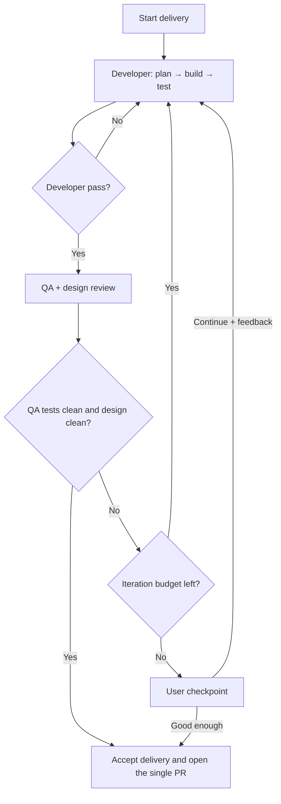

# Delivery Orchestration

## Lifecycle



## Outer iteration

One outer iteration contains:

1. a completed developer loop;
2. a completed QA loop with no remaining test issues;
3. a completed design review;
4. one orchestrator evaluation.

Developer self-fix cycles and QA test-repair cycles occur inside the same outer
iteration and are retained as `cycle-NN` evidence.

## Concurrency

Only QA and design review may run concurrently, and only after developer
self-testing passes. Never run two product-code writers concurrently.

The maximum concurrent subagent thread count is three, excluding the primary
orchestrator.

## Gate semantics

QA's own work is valid when all test issues are repaired and every planned test
either passed or exposed a documented product bug. A documented product bug
still fails the delivery gate and returns to the developer.

The delivery closes naturally only when:

- developer status is `pass` and `openIssues` is empty;
- QA `testIssues` and `productIssues` are empty;
- every QA planned test is `passed`;
- design status is `pass` or justified `not_applicable`;
- design `issues` is empty.

## Five-iteration checkpoint

The delivery begins with an iteration limit of five. If it cannot close after
iteration 5, the controller changes state to `awaiting_user_feedback` and all
agents stop.

`continue` adds five to the delivery's limit; it does not reset evidence or
erase earlier reports. `good enough` snapshots open issues as accepted
deviations and closes the delivery with exceptions.

## Commands

```bash
node tools/workflow.mjs status
node tools/workflow.mjs start-iteration
node tools/workflow.mjs evaluate
node tools/workflow.mjs feedback good-enough --message-file <path>
node tools/workflow.mjs feedback continue --roles developer,qa,design --message-file <path>
node tools/workflow.mjs validate
```

Only the primary orchestrator runs state-changing commands.
